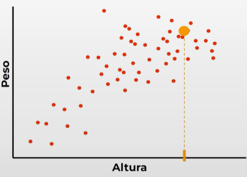
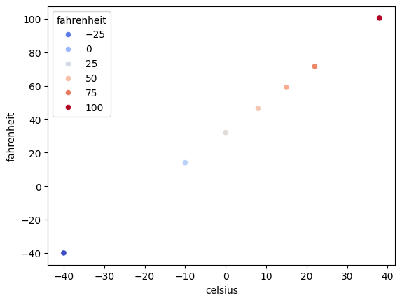

# Regresión lineal

Uno de los principales algoritmos de machine learning y se puede usar cuando tenemos datos que, si los graficamos, muestran una relación que podría ser representada con una linea.

### Ejemplo

Podemos tener una grafica que nos muestre en el eje horizontal X la altura de una serie de personas y en el eje vertical Y el peso de cada una.

<div align="center">
    
</div>

<!--  -->

Como en la imagen, si se sigue la tendencia, conociendo solo la altura de la persona se puede predecir su peso aproximado, ya que de manera general, a mas altura hay mas peso.

En este caso se aplicara la regresión lineal al problema mas simple posible.

## Actividad

En este caso se crear nuestro propio conjunto de datos indicando grados celsius y sus respectivos grados Fahrenheit.

A diferencia del ejemplo la relación de este caso es perfectamente lineal, pero sirve para un primer modelo.

Igualmente imaginaremos que **no conocemos la formula para convertir Celsius a Fahrenheit**.

###### Que es (32 °F − 32) × 5/9 = 0 °C

### Objetivo

Crear un modelo de regresión lineal que aprenda a convertir grados Celsius a Fahrenheit (sin la formula).

## Proceso

Siguiendo el proceso e machine learning, necesitamos datos. Para ello preparare un conjunto de datos sencillo y será trabajo del algoritmo encontrar la relación entre ellos y ajustar una linea a los datos con el algoritmo de regresión lineal.

Con esta linea podremos predecir datos que el modelo nunca ha visto.

### Datos

Para los datos creare un CSV (delimitado por comas) donde se introducira la informacion

1. La primer fila son los encabezados
2. Posteriormente debemos escribir suficientes ejemplos de grados Celsius y sus equivalencias correspondientes en Fahrenheit (entre 5 y 10 ejemplos)

Nuestros datos en formato de tabla
|celsius|fahrenheit|
|---|---|
|-40|-40|
|-10|14|
|0|32|
|8|46.4|
|15|59|
|22|71.6|
|38|100.4|

Nuestros datos como contenido en CSV
```csv
celsius, fahrenheit
-40,-40
-10,14
0,32
8,46.4
15,59
22,71.6
38,100.4
```

Claramente se requieren de mas datos para predicciones mas complejas y precisas pero parece ser suficiente para nuestro caso.


```python
# Paso 1. Importar pandas

import pandas as pd

# Obtenemos los datos que acabamos de crear
datos = pd.read_csv("../assets/celsius.csv")
```

Se puede usar metodos de pandas para obtener informacion, como lo es **info()** con el siguiente comando:


```python
datos.info()
```

    <class 'pandas.core.frame.DataFrame'>
    RangeIndex: 7 entries, 0 to 6
    Data columns (total 2 columns):
     #   Column      Non-Null Count  Dtype  
    ---  ------      --------------  -----  
     0   celsius     7 non-null      int64  
     1   fahrenheit  7 non-null      float64
    dtypes: float64(1), int64(1)
    memory usage: 244.0 bytes
    

Se puede observar que, tenemos 2 columnas, cada una con 7 datos y en ambso casos ninguno esta vacio, siendo los de Celsius de tipo `int` y Fahrenheit de tipo `float`.

Otra forma de ver los datos es la siguiente:


```python
datos.head()
```


<div>
<style scoped>
    .dataframe tbody tr th:only-of-type {
        vertical-align: middle;
    }

    .dataframe tbody tr th {
        vertical-align: top;
    }

    .dataframe thead th {
        text-align: right;
    }
</style>
<table border="1" class="dataframe">
  <thead>
    <tr style="text-align: right;">
      <th></th>
      <th>celsius</th>
      <th>fahrenheit</th>
    </tr>
  </thead>
  <tbody>
    <tr>
      <th>0</th>
      <td>-40</td>
      <td>-40.0</td>
    </tr>
    <tr>
      <th>1</th>
      <td>-10</td>
      <td>14.0</td>
    </tr>
    <tr>
      <th>2</th>
      <td>0</td>
      <td>32.0</td>
    </tr>
    <tr>
      <th>3</th>
      <td>8</td>
      <td>46.4</td>
    </tr>
    <tr>
      <th>4</th>
      <td>15</td>
      <td>59.0</td>
    </tr>
  </tbody>
</table>
</div>


Ahora para realizar una grafica de los datos utilizaremos [seaborn](https://pypi.org/project/seaborn/), para ello haremos la importación primero.


```python
import seaborn as sb

# Creamos una grafica de tipo scatter

#Le decimos los ejes y pasamos los datos
sb.scatterplot(x="celsius", y="fahrenheit", data=datos, hue="fahrenheit", palette="coolwarm")

# Se puede ajustar el color y la paleta de colores con "hue" y "palette" pero es opcional
```


    <Axes: xlabel='celsius', ylabel='fahrenheit'>


    

    


La grafgica se crea como era esperado y se puede apreciar la relacion perfectamente lineal, posteriormente se entenara al modelo para que se ajuste a esta linea en las predicciones.

El ajuste de paleta con coolwarm permite identificar mejor la visualizacion de acorde a la temperatura.

### Preparación de los datos

1. Separarlos por caracteristicas (X), etiqueta (Y).

En este caso y en base a los datos podemos ver que **la caracteristica son los grados celsius y la etiqueta son los grados fahrenheit**, cuando el modelo y los datos sean mas complejos habra muchas caracteristicas y una sola salida.


```python
# Creamos un arreglo para cada eje (X y Y) con los datos de estos.

X = datos["celsius"]
print(X)
Y = datos["fahrenheit"]
```

    0   -40
    1   -10
    2     0
    3     8
    4    15
    5    22
    6    38
    Name: celsius, dtype: int64
    

Ahora podemos acceder a los datos de diversas formas como arreglos u objetos de numpy, pero es requerido que los datos esten en otro formato en lugar se solo ser un simple arreglo con datos.

Necesitamos que sea **un arreglo con arreglos de cada una de las posiciones**, es decir:
`[[-40],[-10],[0],[8],[15],[22],[38]]`

Esto ya que en el futuro podria haber mas de una caracteristica, es decir, ahora solo estamos utilizando un dato de caracteristica (X), pero en otros casos habrá mas.

Para esto usare una función de [numpy](https://pypi.org/project/numpy/) `x.values.reshape()`.


```python
X_PROCESADO = X.values.reshape(-1,1) # Realizamos la transformacion (simple pero requerida)
print(X_PROCESADO)
Y_PROCESADA = Y.values.reshape(-1,1)
```

    [[-40]
     [-10]
     [  0]
     [  8]
     [ 15]
     [ 22]
     [ 38]]
    

Ahora para crear el modelo vamos a utilizar [sklearn](https://pypi.org/project/numpy/). La biblioteca sklearn cuenta con varios modelos pero utilizaremos el de regresion lineal.


```python
from sklearn.linear_model import LinearRegression

# Realizamos la instancia del modelo de regresion lineal
modelo = LinearRegression()
```

El modelo ya esta hecho, pero no puede usarse para predecir porque aun no esta entrenado, por lo que para entrenarlo, necesitamos darle los datos de X y de Y.

#### Entrenamiento

Es decir, debemos darle las entradas y salidas para que el modelo haga su proceso, ajuste la linea y podamos hacer predicciones; para esto se utiliza el metodo `fit()`.


```python
# Entrenamiento
modelo.fit(X_PROCESADO, Y_PROCESADA) # Damos X y Y
```


<style>#sk-container-id-1 {
  /* Definition of color scheme common for light and dark mode */
  --sklearn-color-text: #000;
  --sklearn-color-text-muted: #666;
  --sklearn-color-line: gray;
  /* Definition of color scheme for unfitted estimators */
  --sklearn-color-unfitted-level-0: #fff5e6;
  --sklearn-color-unfitted-level-1: #f6e4d2;
  --sklearn-color-unfitted-level-2: #ffe0b3;
  --sklearn-color-unfitted-level-3: chocolate;
  /* Definition of color scheme for fitted estimators */
  --sklearn-color-fitted-level-0: #f0f8ff;
  --sklearn-color-fitted-level-1: #d4ebff;
  --sklearn-color-fitted-level-2: #b3dbfd;
  --sklearn-color-fitted-level-3: cornflowerblue;

  /* Specific color for light theme */
  --sklearn-color-text-on-default-background: var(--sg-text-color, var(--theme-code-foreground, var(--jp-content-font-color1, black)));
  --sklearn-color-background: var(--sg-background-color, var(--theme-background, var(--jp-layout-color0, white)));
  --sklearn-color-border-box: var(--sg-text-color, var(--theme-code-foreground, var(--jp-content-font-color1, black)));
  --sklearn-color-icon: #696969;

  @media (prefers-color-scheme: dark) {
    /* Redefinition of color scheme for dark theme */
    --sklearn-color-text-on-default-background: var(--sg-text-color, var(--theme-code-foreground, var(--jp-content-font-color1, white)));
    --sklearn-color-background: var(--sg-background-color, var(--theme-background, var(--jp-layout-color0, #111)));
    --sklearn-color-border-box: var(--sg-text-color, var(--theme-code-foreground, var(--jp-content-font-color1, white)));
    --sklearn-color-icon: #878787;
  }
}

#sk-container-id-1 {
  color: var(--sklearn-color-text);
}

#sk-container-id-1 pre {
  padding: 0;
}

#sk-container-id-1 input.sk-hidden--visually {
  border: 0;
  clip: rect(1px 1px 1px 1px);
  clip: rect(1px, 1px, 1px, 1px);
  height: 1px;
  margin: -1px;
  overflow: hidden;
  padding: 0;
  position: absolute;
  width: 1px;
}

#sk-container-id-1 div.sk-dashed-wrapped {
  border: 1px dashed var(--sklearn-color-line);
  margin: 0 0.4em 0.5em 0.4em;
  box-sizing: border-box;
  padding-bottom: 0.4em;
  background-color: var(--sklearn-color-background);
}

#sk-container-id-1 div.sk-container {
  /* jupyter's `normalize.less` sets `[hidden] { display: none; }`
     but bootstrap.min.css set `[hidden] { display: none !important; }`
     so we also need the `!important` here to be able to override the
     default hidden behavior on the sphinx rendered scikit-learn.org.
     See: https://github.com/scikit-learn/scikit-learn/issues/21755 */
  display: inline-block !important;
  position: relative;
}

#sk-container-id-1 div.sk-text-repr-fallback {
  display: none;
}

div.sk-parallel-item,
div.sk-serial,
div.sk-item {
  /* draw centered vertical line to link estimators */
  background-image: linear-gradient(var(--sklearn-color-text-on-default-background), var(--sklearn-color-text-on-default-background));
  background-size: 2px 100%;
  background-repeat: no-repeat;
  background-position: center center;
}

/* Parallel-specific style estimator block */

#sk-container-id-1 div.sk-parallel-item::after {
  content: "";
  width: 100%;
  border-bottom: 2px solid var(--sklearn-color-text-on-default-background);
  flex-grow: 1;
}

#sk-container-id-1 div.sk-parallel {
  display: flex;
  align-items: stretch;
  justify-content: center;
  background-color: var(--sklearn-color-background);
  position: relative;
}

#sk-container-id-1 div.sk-parallel-item {
  display: flex;
  flex-direction: column;
}

#sk-container-id-1 div.sk-parallel-item:first-child::after {
  align-self: flex-end;
  width: 50%;
}

#sk-container-id-1 div.sk-parallel-item:last-child::after {
  align-self: flex-start;
  width: 50%;
}

#sk-container-id-1 div.sk-parallel-item:only-child::after {
  width: 0;
}

/* Serial-specific style estimator block */

#sk-container-id-1 div.sk-serial {
  display: flex;
  flex-direction: column;
  align-items: center;
  background-color: var(--sklearn-color-background);
  padding-right: 1em;
  padding-left: 1em;
}


/* Toggleable style: style used for estimator/Pipeline/ColumnTransformer box that is
clickable and can be expanded/collapsed.
- Pipeline and ColumnTransformer use this feature and define the default style
- Estimators will overwrite some part of the style using the `sk-estimator` class
*/

/* Pipeline and ColumnTransformer style (default) */

#sk-container-id-1 div.sk-toggleable {
  /* Default theme specific background. It is overwritten whether we have a
  specific estimator or a Pipeline/ColumnTransformer */
  background-color: var(--sklearn-color-background);
}

/* Toggleable label */
#sk-container-id-1 label.sk-toggleable__label {
  cursor: pointer;
  display: flex;
  width: 100%;
  margin-bottom: 0;
  padding: 0.5em;
  box-sizing: border-box;
  text-align: center;
  align-items: start;
  justify-content: space-between;
  gap: 0.5em;
}

#sk-container-id-1 label.sk-toggleable__label .caption {
  font-size: 0.6rem;
  font-weight: lighter;
  color: var(--sklearn-color-text-muted);
}

#sk-container-id-1 label.sk-toggleable__label-arrow:before {
  /* Arrow on the left of the label */
  content: "▸";
  float: left;
  margin-right: 0.25em;
  color: var(--sklearn-color-icon);
}

#sk-container-id-1 label.sk-toggleable__label-arrow:hover:before {
  color: var(--sklearn-color-text);
}

/* Toggleable content - dropdown */

#sk-container-id-1 div.sk-toggleable__content {
  max-height: 0;
  max-width: 0;
  overflow: hidden;
  text-align: left;
  /* unfitted */
  background-color: var(--sklearn-color-unfitted-level-0);
}

#sk-container-id-1 div.sk-toggleable__content.fitted {
  /* fitted */
  background-color: var(--sklearn-color-fitted-level-0);
}

#sk-container-id-1 div.sk-toggleable__content pre {
  margin: 0.2em;
  border-radius: 0.25em;
  color: var(--sklearn-color-text);
  /* unfitted */
  background-color: var(--sklearn-color-unfitted-level-0);
}

#sk-container-id-1 div.sk-toggleable__content.fitted pre {
  /* unfitted */
  background-color: var(--sklearn-color-fitted-level-0);
}

#sk-container-id-1 input.sk-toggleable__control:checked~div.sk-toggleable__content {
  /* Expand drop-down */
  max-height: 200px;
  max-width: 100%;
  overflow: auto;
}

#sk-container-id-1 input.sk-toggleable__control:checked~label.sk-toggleable__label-arrow:before {
  content: "▾";
}

/* Pipeline/ColumnTransformer-specific style */

#sk-container-id-1 div.sk-label input.sk-toggleable__control:checked~label.sk-toggleable__label {
  color: var(--sklearn-color-text);
  background-color: var(--sklearn-color-unfitted-level-2);
}

#sk-container-id-1 div.sk-label.fitted input.sk-toggleable__control:checked~label.sk-toggleable__label {
  background-color: var(--sklearn-color-fitted-level-2);
}

/* Estimator-specific style */

/* Colorize estimator box */
#sk-container-id-1 div.sk-estimator input.sk-toggleable__control:checked~label.sk-toggleable__label {
  /* unfitted */
  background-color: var(--sklearn-color-unfitted-level-2);
}

#sk-container-id-1 div.sk-estimator.fitted input.sk-toggleable__control:checked~label.sk-toggleable__label {
  /* fitted */
  background-color: var(--sklearn-color-fitted-level-2);
}

#sk-container-id-1 div.sk-label label.sk-toggleable__label,
#sk-container-id-1 div.sk-label label {
  /* The background is the default theme color */
  color: var(--sklearn-color-text-on-default-background);
}

/* On hover, darken the color of the background */
#sk-container-id-1 div.sk-label:hover label.sk-toggleable__label {
  color: var(--sklearn-color-text);
  background-color: var(--sklearn-color-unfitted-level-2);
}

/* Label box, darken color on hover, fitted */
#sk-container-id-1 div.sk-label.fitted:hover label.sk-toggleable__label.fitted {
  color: var(--sklearn-color-text);
  background-color: var(--sklearn-color-fitted-level-2);
}

/* Estimator label */

#sk-container-id-1 div.sk-label label {
  font-family: monospace;
  font-weight: bold;
  display: inline-block;
  line-height: 1.2em;
}

#sk-container-id-1 div.sk-label-container {
  text-align: center;
}

/* Estimator-specific */
#sk-container-id-1 div.sk-estimator {
  font-family: monospace;
  border: 1px dotted var(--sklearn-color-border-box);
  border-radius: 0.25em;
  box-sizing: border-box;
  margin-bottom: 0.5em;
  /* unfitted */
  background-color: var(--sklearn-color-unfitted-level-0);
}

#sk-container-id-1 div.sk-estimator.fitted {
  /* fitted */
  background-color: var(--sklearn-color-fitted-level-0);
}

/* on hover */
#sk-container-id-1 div.sk-estimator:hover {
  /* unfitted */
  background-color: var(--sklearn-color-unfitted-level-2);
}

#sk-container-id-1 div.sk-estimator.fitted:hover {
  /* fitted */
  background-color: var(--sklearn-color-fitted-level-2);
}

/* Specification for estimator info (e.g. "i" and "?") */

/* Common style for "i" and "?" */

.sk-estimator-doc-link,
a:link.sk-estimator-doc-link,
a:visited.sk-estimator-doc-link {
  float: right;
  font-size: smaller;
  line-height: 1em;
  font-family: monospace;
  background-color: var(--sklearn-color-background);
  border-radius: 1em;
  height: 1em;
  width: 1em;
  text-decoration: none !important;
  margin-left: 0.5em;
  text-align: center;
  /* unfitted */
  border: var(--sklearn-color-unfitted-level-1) 1pt solid;
  color: var(--sklearn-color-unfitted-level-1);
}

.sk-estimator-doc-link.fitted,
a:link.sk-estimator-doc-link.fitted,
a:visited.sk-estimator-doc-link.fitted {
  /* fitted */
  border: var(--sklearn-color-fitted-level-1) 1pt solid;
  color: var(--sklearn-color-fitted-level-1);
}

/* On hover */
div.sk-estimator:hover .sk-estimator-doc-link:hover,
.sk-estimator-doc-link:hover,
div.sk-label-container:hover .sk-estimator-doc-link:hover,
.sk-estimator-doc-link:hover {
  /* unfitted */
  background-color: var(--sklearn-color-unfitted-level-3);
  color: var(--sklearn-color-background);
  text-decoration: none;
}

div.sk-estimator.fitted:hover .sk-estimator-doc-link.fitted:hover,
.sk-estimator-doc-link.fitted:hover,
div.sk-label-container:hover .sk-estimator-doc-link.fitted:hover,
.sk-estimator-doc-link.fitted:hover {
  /* fitted */
  background-color: var(--sklearn-color-fitted-level-3);
  color: var(--sklearn-color-background);
  text-decoration: none;
}

/* Span, style for the box shown on hovering the info icon */
.sk-estimator-doc-link span {
  display: none;
  z-index: 9999;
  position: relative;
  font-weight: normal;
  right: .2ex;
  padding: .5ex;
  margin: .5ex;
  width: min-content;
  min-width: 20ex;
  max-width: 50ex;
  color: var(--sklearn-color-text);
  box-shadow: 2pt 2pt 4pt #999;
  /* unfitted */
  background: var(--sklearn-color-unfitted-level-0);
  border: .5pt solid var(--sklearn-color-unfitted-level-3);
}

.sk-estimator-doc-link.fitted span {
  /* fitted */
  background: var(--sklearn-color-fitted-level-0);
  border: var(--sklearn-color-fitted-level-3);
}

.sk-estimator-doc-link:hover span {
  display: block;
}

/* "?"-specific style due to the `<a>` HTML tag */

#sk-container-id-1 a.estimator_doc_link {
  float: right;
  font-size: 1rem;
  line-height: 1em;
  font-family: monospace;
  background-color: var(--sklearn-color-background);
  border-radius: 1rem;
  height: 1rem;
  width: 1rem;
  text-decoration: none;
  /* unfitted */
  color: var(--sklearn-color-unfitted-level-1);
  border: var(--sklearn-color-unfitted-level-1) 1pt solid;
}

#sk-container-id-1 a.estimator_doc_link.fitted {
  /* fitted */
  border: var(--sklearn-color-fitted-level-1) 1pt solid;
  color: var(--sklearn-color-fitted-level-1);
}

/* On hover */
#sk-container-id-1 a.estimator_doc_link:hover {
  /* unfitted */
  background-color: var(--sklearn-color-unfitted-level-3);
  color: var(--sklearn-color-background);
  text-decoration: none;
}

#sk-container-id-1 a.estimator_doc_link.fitted:hover {
  /* fitted */
  background-color: var(--sklearn-color-fitted-level-3);
}
</style><div id="sk-container-id-1" class="sk-top-container"><div class="sk-text-repr-fallback"><pre>LinearRegression()</pre><b>In a Jupyter environment, please rerun this cell to show the HTML representation or trust the notebook. <br />On GitHub, the HTML representation is unable to render, please try loading this page with nbviewer.org.</b></div><div class="sk-container" hidden><div class="sk-item"><div class="sk-estimator fitted sk-toggleable"><input class="sk-toggleable__control sk-hidden--visually" id="sk-estimator-id-1" type="checkbox" checked><label for="sk-estimator-id-1" class="sk-toggleable__label fitted sk-toggleable__label-arrow"><div><div>LinearRegression</div></div><div><a class="sk-estimator-doc-link fitted" rel="noreferrer" target="_blank" href="https://scikit-learn.org/1.6/modules/generated/sklearn.linear_model.LinearRegression.html">?<span>Documentation for LinearRegression</span></a><span class="sk-estimator-doc-link fitted">i<span>Fitted</span></span></div></label><div class="sk-toggleable__content fitted"><pre>LinearRegression()</pre></div> </div></div></div></div>


En este caso es muy rapido ya que son muy pocos datos.

Para este punto el modelo ya ajusto la linea, por lo que podriamos darle tempreaturas en Celsius que nunca ha visto y nos va a hacer una predicción.

#### Prediccion

Para hacer una predicción se utiliza el metodo `predict()`, pero debemos especificar de igual forma que dimos los datos las caracteristicas (X), por ejemplo, si le doy 8 grados Celsius debe darnos 46.4 grados Fahrenheit.


```python
modelo.predict([[8]]) # Se le da la caracteristica en el formato en que se le entregaron
```


    array([[46.4]])


En este caso 8 viene dentro del conjunto de datos, por lo que probare con otro, en este caso 35 grados Celsius (que deberia dar 95F según la formula).

(35 °C × 9/5) + 32 = 95 °F


```python
celsius = 35
prediccion = modelo.predict([[celsius]])
print(f"Nuestro modelo dice que {celsius}C son {prediccion[0]}F")
```

    Nuestro modelo dice que 35C son [95.]F
    

La relación es perfectamente lineal por lo que el modelo no tiene problemas para predecir de forma exacta.

Algo mas que podemos hacer es llamar a `score()` para evaluar con las X y Y.

Esto nos resultara en un numero dentre el 0 y el 1 para ver que tan bien entrenado esta según los datos.


```python
modelo.score(X_PROCESADO, Y_PROCESADA)
```


    1.0


Naturalmente en el mundo real jamas llegaremos al 1.0 ya que los datos suelen estar dispersos y siempre habrá un nivel de error.
